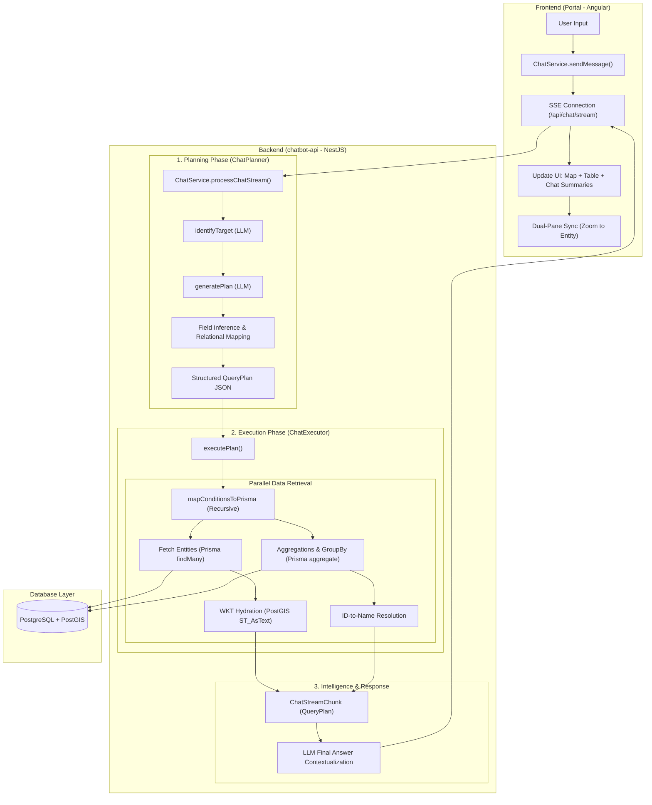

# GIS Chatbot Architecture & Workflow

This diagram represents the high-level architecture and the internal logical flow of the Data Pilot GIS Assistant.

## Key Workflow Details

### 1. Intelligent Field Inference
When a user asks for a field not present on the target entity (e.g., "Mines of type Neodymium"), the **Planner** automatically:
- Identifies the correct target (`Mine`).
- Infers the relation holding the field (`Cluster`).
- Generates a recursive `RelationFilter` to bridge the gap.

### 2. Analytical Engine
For queries involving statistics (e.g., "Top 10 mines by quantity"), the **Executor**:
- Performs `groupBy` and `orderBy` calculations directly in the database.
- Resolves technical UUIDs into human-readable names for UI presentation.
- Sets the `isStatsOnly` flag to prioritize analytical summaries over geographic markers when appropriate.

### 3. Dual-Batch Hydration
To maintain high UI responsiveness:
- **Batch 1**: Returns lightweight names and IDs immediately.
- **Batch 2**: Returns heavy spatial (WKT) data for map visualization once available.
